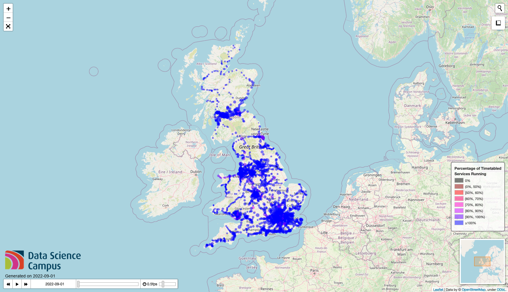
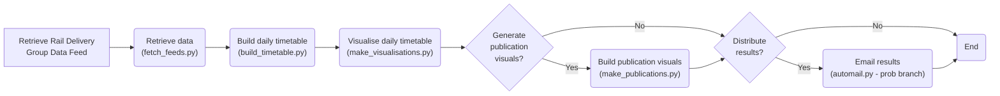

# Rail Reporter

This code was created as part of [this Data Science Campus project](https://datasciencecampus.ons.gov.uk/visualising-rail-schedules-using-open-data/)
on visualising GB rail network planned disruptions.

Rail services can be affected by temporary factors such as unseasonably hot weather, industrial action and engineering works.  While truly unexpected events
cannot of course be predicted, we can use readliy available rail scheduling data to visualise the impact of known cancellations and rescheduling on the number
of movements that would 'normally' be expected through stations.

To understand the extent of reductions in services on a given day, we look at any revisions to the daily schedules,
which could include cancellations, additions and amendments.
For every station, we visualised the latest planned service level as a proportion of the originally timetabled service levels.

Data have been obtained from the Rail Delivery Group via a daily feed which is available for reuse. Data are made available
to us overnight each day, from which we generate the visuals.


*Above, a shot of the output of the process, interactive visualisations (HTML) of expected scheduled movement levels.*


*Above, the pipeline for creating these visualisations.*

---

## Setup

We expect our code to work on OSX and Linux systems.

### Get access to data

The Rail Delivery Group provides access to this data (if approved) through SFTP
(Secure File Transfer Protocol) servers.  To register for access visit [the web portal](https://dtdportal.atocrsp.org/).
Information about the data feeds can be found at the Rail Delivery Group's [main website](https://www.raildeliverygroup.com/our-services/rail-data/timetable-data.html).
Information on any restrictions on the use of such data can also be found here.
Once access is granted, retrieval of the latest data can be automated as we have done in this project
(our code for this resides in `src/fetch_feeds.py` if of interest).

### Installation

To clone this repo, set up a python virtual environment and install python
dependencies (OSX/Linux):

```shell
git clone https://github.com/datasciencecampus/rail_reporter.git
cd rail_reporter

python -m venv env          # Set up then activate virtual environment
source env/bin/activate

python -m pip install --upgrade pip       # Install packages
python -m pip install -r requirements.txt

brew install direnv   # Install (OSX) if not installed already
direnv allow   # Allow direnv to make available project environment variables

brew install firefox     # Used to create static images from html
brew install geckodriver # Used to create static images from html
```

Note: you may need to add `eval "$(direnv hook zsh)"` to the ~/.zshrc file during an initial setup.

### Secrets (logins etc)

You will need to create a .secrets file in the project root directory with
the following information:

```
# For configuring data ingest (connection details for SFTP server)
export RAIL_FEED_USER=<DTD data feed username>
export RAIL_FEED_PASS=<DTD data feed password>
export RAIL_FEED_HOST=<DTD data feed remote server host name/endpoint>
export RAIL_FEED_PORT=<DTD data feed port (usually 22, and not secret)>
```

---

## Run pipeline

The intention is to integrate all steps into a process with one trigger script.
Currently only fetching rail data is fully implemented.

```shell
python run.py
```

We have automated this using crontab on Mac.  Setting this up requires some
additional steps.  For instructions on enabling crontab on OSX [see here](https://osxdaily.com/2020/04/27/fix-cron-permissions-macos-full-disk-access/).
For a tutorial on how to set up a cron job (scheduled program) [see here](https://www.youtube.com/watch?v=QZJ1drMQz1A).
For a useful tool for composing cron schedules/instructions [see here](https://crontab.guru/).

- make the run script executable with: `chmod u+x run.sh`

- our cron schedule entry: `0 5 * * * cd <project_folder> && ./run.sh`

## Run off publication

Not frequently used, a wrapper script that simply regenerates the publication
visualisations used in our blogs with the latest data, should they be needed.

See the script `run_publications.py` itself to see examples of configs for
running over specific time windows or with past data.

```shell
python run_publications.py
```

---

## Running steps independently

#### Request ATCO.CIF Data
First, to request all recent ATCO.CIF data:

```shell
python src/fetch_feeds.py <feed_type> <target_folder>
```

The arguments:
* `<feed_type>` is the  name of the type of feed to download (it is in fact
the name of the subdirectory on the SFTP server to search for new files).  Currently on the server,
for timetable data this would be `timetable`
* `<target_folder>` is a path to a local directory to save any discovered files to.

#### Build Timetable
Then, build a timetable by running:

```shell
python src/build_timetable.py <zip_name> <data_directory> <output_directory>
```

The Arguments:
* `<zip_file_name>` is the name of the ATCO.CIF zip file to work on (include.zip file extension).
* `<data_directory>` is the directory containing that file.
* `<output_directory>` is the directory to save results to.

Two optional parameters:
* `--dump_date`, which is a string in DDMMYYYY format format corresponding to the day in which the ATCO.CIF zip file was "dumped". If this is not provided,
the default assumption is the ATCO.CIF zip file was "dumped" on the current day of the run call.
* `--start_date`, which is a string in DDMMYYY format corresponding to the day from which the timetable will be built.  Default is the current date.
* `--no_days`, the number of days including start date for which to create results running in to the future.

An example call using these optional parameters could be:

```shell
python src/build_timetable.py <zip_file_name> <data_directory> <output_directory> --dump_date 01082022 --date 02082022
```

Which would use `<zip_file_name>`, take the ATCO.CIF data "dump" date as 01/Aug/2022 and filter it to 02/Aug/2022.

#### Make Visualisations

Then, can make visualisations by running:
```shell
python src/make_visualisations.py
```

Numerous optional parameters:
* `--working_directory`, the working directory. Default behaviour will be ./outputs/.
* `--csv_input_filename`, the csv file generated by `build_timetable.py`. Default will search in the ./outputs/ folder for a csv file for the day on which the script call occurs.
* `--start_date`, which is a string in DDMMYYY format corresponding to the first visual day. Default is the day on which the script call occurs.
* `--no_days`, number of days to visualise, default is 30days.
* `--scale_markers_on`, set which feature to scale the size of the markers on. Default is `journeys_timetabled`.
* `--measure_control`, adds a measure control object. Default behavious will add the measure control without this flag.
* `--mini_map`, add a mini map. Default behavious will add the mini map without this flag.
* `--full_screen`, add a full_screen button. Default behavious will add the full screen button without this flag.
* `--add_geocoder`, a flag to add geocoder object (search for place). Default behavious will add the geocoder without this flag.

#### Make Publications

This scipt follows along the same lines as `make_visualisations.py`, but focuses on generating visuals for publications/blogs. In particular, it generates single day and timeseries visuals with more accessible maps and layouts. It can executed by running:

```shell
python src/make_publications.py
```

Numerous optional parameters:
* `--working_directory`, the working directory. Default behaviour will be ./outputs/.
* `--csv_input_filename`, the csv file generated by `build_timetable.py`. Default will search in the ./outputs/ folder for a csv file for the day on which the script call occurs.
* `--start_date`, which is a string in DDMMYYY format corresponding to the first visual day. Default is the day on which the script call occurs.
* `--end_date`, which is a string in DDMMYYY format corresponding to the last visual day. If not set (default) a single day visual (for start_date) will be generated
* `--scale_markers_on`, set which feature to scale the size of the markers on. Default is `journeys_timetabled`.
* `--measure_control`, adds a measure control object. Default behaviour will NOT add the measure control without this flag.
* `--mini_map`, add a mini map. Default behaviour will NOT add the mini map without this flag.
* `--full_screen`, add a full_screen button. Default behaviour will NOT add the full screen button without this flag.
* `--add_geocoder`, a flag to add geocoder object (search for place). Default behaviour will add the geocoder without this flag.

---
